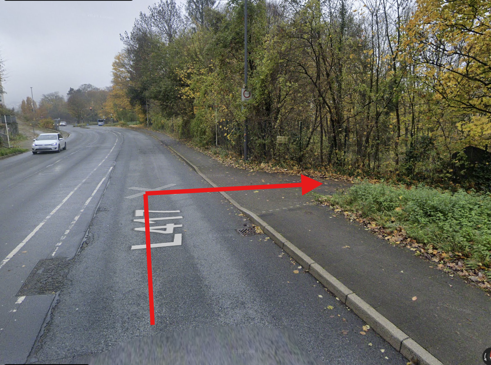

+++
title = "Tims 40. Geburtstag"
+++

# Wo und Wann

Ich feiere meinen Geburtstag am **19.10.2024 ab 18:00 Uhr** im Clubraum der Wasserfreunde Wuppertal e.V. 

# Anfahrt 
Der Clubraum ist über den Zugang an der [Ronsdorfer Straße 195, 42285 Wuppertal](https://maps.app.goo.gl/bndTJ3gkqSNpg8jB9) zu erreichen.   
Hierbei handelt es sich um einen schmalen Nebenweg.

<iframe src="https://www.google.com/maps/embed?pb=!1m21!1m12!1m3!1d1050.0037875989806!2d7.160973870245907!3d51.24957623624921!2m3!1f0!2f0!3f0!3m2!1i1024!2i768!4f13.1!4m6!3e0!4m0!4m3!3m2!1d51.24914007236816!2d7.162604770549551!5e0!3m2!1sde!2sde!4v1728937743094!5m2!1sde!2sde" width="600" height="450" style="border:0;" allowfullscreen="" loading="lazy" referrerpolicy="no-referrer-when-downgrade"></iframe>

## Auto 

Vor dem Zugang zum Clubraum gibt es Parkplätze 4-5 PKW, die über den Nebenweg erreicht erreicht werden können.
Die Zufahrt ist recht schmal und wenn mal von oben kommt, ist die Kurve steiler als 90 Grad. Dementsprechend seid bitte vorsichtig. 

  

## Bus und Bahn

Die nächstgelegene Bushaltestelle **Wuppertal Kronprizenallee** ist vier Gehminuten entfernt.  
Vom Wuppertaler Hauptbahnhof dauert es mit Linie 620 etwa 11 Minuten bis zur Haltestelle oder etwa 20 Minuten zu Fuß, allerdings konstant bergauf.  
Bei Bedarf können wir euch bestimmt auch am Bahnhof abholen. Sagt mir bitte einfach einen Tag vorher Bescheid.   

# Essen und Trinken

Ich kümmere mich um Getränke, Knabbereien und eine gewisse Grundauswahl an Leckereien für den Abend.  
Darüber hinaus würde ich mich freuen, wenn ihr das Buffet ebenfalls mit der einen oder anderen Leckerei erweitern würdet.  
Um eine möglichst vielfältige Auswahl habe ich eine [Bring-a-Bottle-Liste](https://bringabottle.de/list/de2cdf52-cb67-48f7-ad2b-b9b1cb62bf97) zur besseren Koordination eingerichtet.   
Bitte tragt dort ein, was ihr gerne mitbringen möchtet.

# Geschenk

Ich freue mich sehr, wenn ihr mit mir feiert und zum Buffet etwas beitragt, so dass wir einen schönen gemeinsamen Abend haben.  
Wenn ihr trotzdem noch etwas schenken möchtet, dann würde ich mich über eine kleine Beteiligung für einen neuen fancy Fahrradcomputer freuen und würde einfach ein Sparschwein aufstellen...